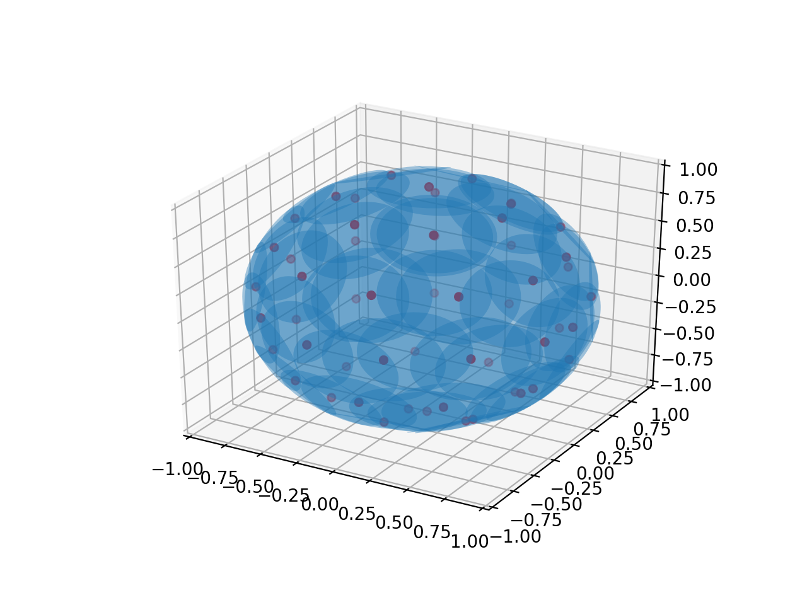

# Sensors

This repository contains the code and report of the project.
To solve the problem we use methods from computational topology.

## Problem description

We are given a set of points on a sphere of radius 1, which we can view as sensors on the surface of the Earth. 
The sensors are used to gather data and form a sensor network with parameters *r* and *R*, where each sensor gathers data from the surrounding area in the shape of a circle of radius *R* and each sensor can communicate with other sensors which are at most *r* away.
The goal of this project was to determine *r* and *R*, so that:

1. numbers *r* and *R* are as small as possible (that would decrease the cost of
sensors),

2. the sensor network is connected (i.e. the Vietoris-Rips graph is connected),

3. the sensor network covers the whole sphere (the Cech complex should be
homotopy equivalent to the sphere, i.e. the Euler characteristic of the Cech complex should be that of a sphere).

Once we established the parameters *r* in *R*, we have also returned a list of obsolete sensors, i.e. sensors, whose removal would not change the desired properties 2. and 3. of the sensor network.
We implemented our method in Python using the GUDHI library for Vietoris-Rips complex.

Figure 1: Sensors distributed on a unit sphere. Sensors cover the whole sphere.

## Solution description

### Finding *R* and *r*

We start with small value of *r* and increment the value by small amount *ε* until all the sensors are connected.
We check if the sensors are connected by checking the number of components of the Vietoris-Rips graph.
To generate the Vietoris-Rips graph and get the number of components we use the GUDHI library.
Once we find the appropriate *r* we set the initial value of *R* to *r/2*.
We start increasing the value of *R* by a small amount *ε* until the sensors can cover the whole sphere. In order to determine if the whole sphere is covered we calculate the Euler characteristic of the Cech complex and compare it to Euler characteristic of a sphere.

### Finding obsolete sensors

Once we have obtained *R* and *r* we can find the sensors that are obsolete.
We simply remove each sensor from the list of sensors and check if the whole sphere is still being covered using the Euler characteristic of the generated Cech complex.
If a sphere is covered we can add the removed sensor to the list of obsolete sensors.

